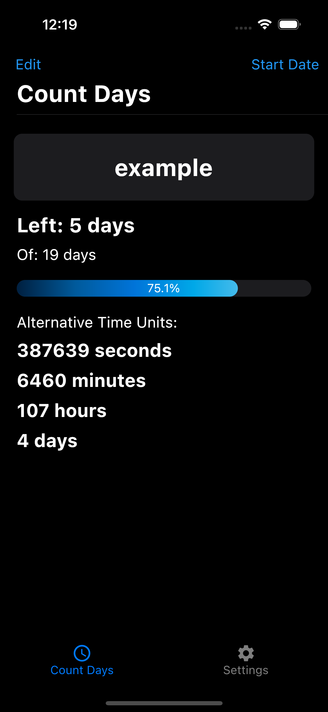
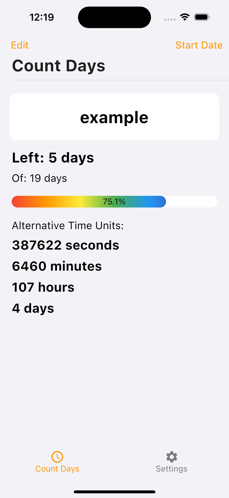

# Table of Contents
- [Licznik App in Dart](#licznik-app-in-dart)
  * [Technologies](#technologies)
  * [What is this?](#what-is-this)
    + [Start Screen](#start-screen)
    + [Add Timer](#add-timer)
    + [Timer Set](#timer-set)
    + [Edit Timer](#edit-timer)
    + [Timer Set With Title](#timer-set-with-title)
    + [Set Start Date](#set-a-start-date)
    + [Timer Finished](#timer-finished)
    + [Settings](#settings)
  * [Install](#install)
  * [Contributing](#contributing)
  * [Project Status](#project-status)
  * [Room for Improvement](#room-for-improvement)
  * [License](#license)

# Count Days App in Dart

This app's main purpose is to keep track of how many days are left until a certain date.

I made this app to get better at using Flutter and making apps for iPhones.

Initially, the app was a simple and basic take on a broader idea to make a really good countdown app. But while working with Flutter, I encountered difficulties incorporating native iOS home screen widgets and in-app purchases, as well as giving the app a genuine iPhone-friendly feel. This led me to rebuild the app using SwiftUI. The revamped version is now available on the App Store, including all the features I had envisioned for the original. If you're curious, you can take a look [here](https://apps.apple.com/pl/app/count-days-simple/id6479526942).

## Technologies
The project is created with:
  * Flutter 3.7.11 on MacOS 14.1.1
  * Xcode 15.0.1
  * VS Code 1.84.2

And tested on various models running iOS < 17.0.

## What is this?
The only feature of this app is counting to a given date, which has to be in the future. You can add only one timer, you are able to give it a name and see how much time has passed based on a percentage value. If the title field is left empty, there will be given a default name to the timer representing a date to which the countdown is set. Plus you are now able to set a custom start date, and change available themes.

### Start Screen
To add the timer, you only have to tap somewhere on the screen. 

### Add Timer
After initially tapping on the screen, you will be prompted with a bottom sheet pop-up that will enable you to choose the date your counter will be set to. Clicking cancel will get you back to the start screen. 

### Timer Set
After adding the first timer without setting the timer, you will get a default name that represents the date you have chosen. To edit the timer, click edit. 

### Edit Timer
After clicking edit the timer, you will be again prompted with a bottom sheet pop-up, allowing you to delete the timer, change the date or title. In this example, I will be adding a title.  
Deleting the timer will get you back to the start screen.  

### Timer Set With Title
Here we can see that the title was set.  
Also below are the different combinations of different themes available in this verison. Note that changing the theme affects every page in this application.

  
   
  

### Set a Start Date
In this setting you can actually choose a custom start date, if you want to get acurate percetage and forgot to start your timer earlier.  

### Timer Finished
This is what appears to the user after the timer has finished  

### Settings
The setting allows you to customize how you want to see the number of days left (rounded up or not). It lets you change the theme between light, dark, and system. It also allows you to change the accent color from blue to orange. This will also have an effect on the percentage bar gradient. Below, there is a button leading to the support count days page, inside which you can leave a small tip for me (the developer). 

## Install
To install the app on your iPhone, you will need a computer running MacOS with installed Flutter, CocoaPods, and Xcode. Additionally, you will need an Apple ID or an Apple Developer account. More detailed instructions on how to do it are [here](https://www.geeksforgeeks.org/how-to-install-flutter-app-on-ios/).

## Contributing

Thank you for your interest in contributing to this project. However, please note that this software is not open source, and contributions are not accepted through pull requests.

If you encounter issues or have suggestions, feel free to open an issue to discuss them. For any major changes or feature requests, please contact the project owner or maintainers directly.

This project is commercially licensed, and reproduction, distribution, or modification of the code for public or private use is strictly prohibited without explicit permission. For inquiries about licensing, support, or other matters, please contact me.

## Project Status
**Project Status:** Completed, but additional features will be rolling out in the coming releases.

## Room for Improvement

To-do:
  * Make Tip Buttons work
  * Add support for polish language
  * Support notifications
  * Support widgets
  * Possibly in the distance future add support for more timers
