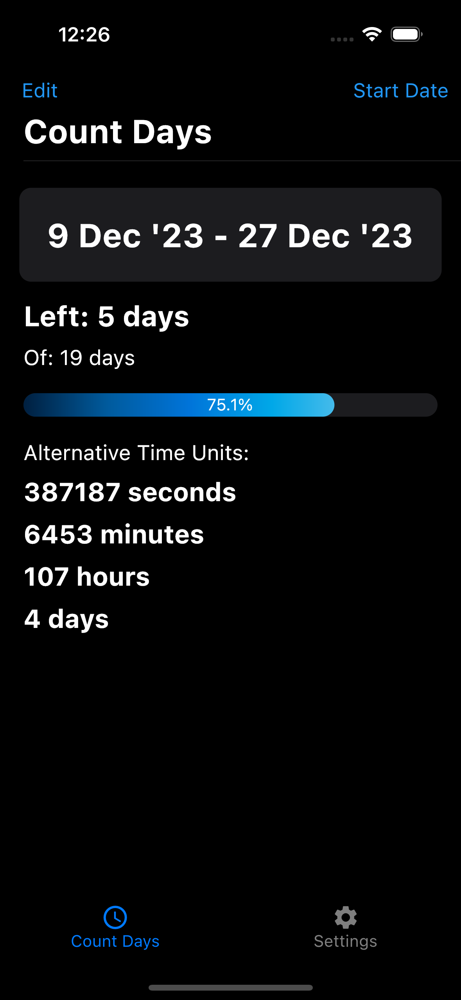

# Table of Contents
- [Licznik App in Dart](#licznik-app-in-dart)
  * [Technologies](#technologies)
  * [What is this?](#what-is-this)
    + [Start Screen](#start-screen)
    + [Add Timer](#add-timer)
    + [Timer Set](#timer-set)
    + [Edit Timer](#edit-timer)
    + [Timer Set With Title](#timer-set-with-title)
    + [Settings](#settings)
  * [Install](#install)
  * [Contributing](#contributing)
  * [License](#license)

# Licznik App in Dart
"Licznik" is Polish for counter.  

The main aim of this application is to count time to a set date.

I created this app as an exercise to learn more about Flutter and iOS app development.

## Technologies
The project is created with:
  * Flutter 3.7.11 on MacOS 14.1.1
  * Xcode 15.0.1
  * VS Code 1.84.2

And running on iPhone 15 Pro (iOS 17.0).

## What is this?
The only feature of this app is counting to a given date, which has to be in the future. You can add only one timer, and you are able to give it a name. If the title field is left empty, there will be given a default name to the timer representing a date to which the countdown is set.

### Start Screen
To add the timer, you only have to tap somewhere on the screen.

### Add Timer
After initially tapping on the screen, you will be prompted with a bottom sheet pop-up that will enable you to choose the date your counter will be set to. Clicking cancel will get you back to the start screen.

### Timer Set
After adding the first timer without setting the timer, you will get a default name that represents the date you have chosen. To edit the timer, click edit.

### Edit Timer
After clicking edit the timer, you will be again prompted with a bottom sheet pop-up, allowing you to delete the timer, change the date or title. In this example, I will be adding a title.  
Deleting the timer will get you back to the start screen.

### Timer Set With Title
Here we can see that the title was set.

### Settings
The setting page is not yet implemented.

## Install
To install the app on your iPhone, you will need a computer running MacOS with installed Flutter, CocoaPods, and Xcode. Additionally, you will need an Apple ID or an Apple Developer account. More detailed instructions on how to do it are [here](https://www.geeksforgeeks.org/how-to-install-flutter-app-on-ios/).

## Contributing
Pull requests are welcome. For major changes, please open an issue first to discuss what you would like to change.

<!-- Please make sure to update tests as appropriate. -->

## License
[GNU GPLv3](https://choosealicense.com/licenses/gpl-3.0/)
